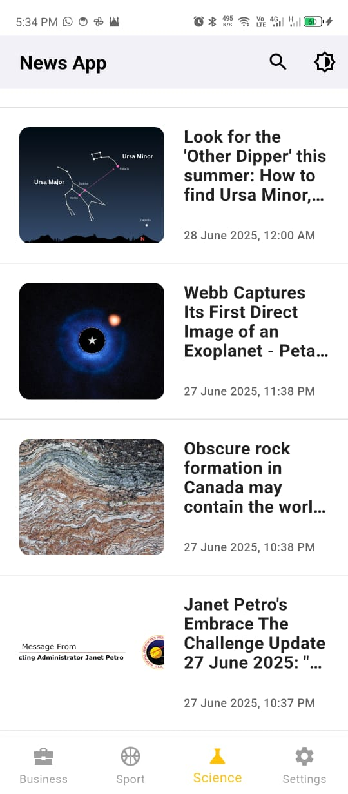

# News App

This is a simple News App built with Flutter.  
It fetches the latest news articles from an API and displays them with clean UI.

## 📸 Screenshot

## ✨ Features
- Fetch latest news
- Beautiful UI
- Dark Mode support
- Search functionality
- State management with Bloc, Cubit, and States

## 🧩 State Management
The app uses [Flutter Bloc](https://pub.dev/packages/flutter_bloc) for predictable and scalable state management:

- Bloc pattern
- Cubit for simpler states
- Well-defined States and Events

## 🚀 How to Run
1. Clone the repo
2. Run `flutter pub get`
3. Run on emulator or device
